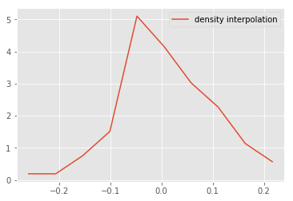

# Probability Density Functions - Lab

In this lab we shall exercise the skills learned in previous lesson to build pdfs for height and weight distributions, both for male and female groups. You are required to build these plots and comment on the results.

## Objectives:

* Calculate the PDF from given dataset containing real valued random variables
* Plot density functions and comment on the shape of the plot. 

Let's get started. We shall import all the required libraries for you for this lab. 


```python
# Import required libraries
import numpy as np
import matplotlib.pyplot as plt
plt.style.use('ggplot')
import pandas as pd 
```

#### Import the dataset 'weight-height.csv' as pandas dataframe . Calculate the mean and standard deviation for weights and heights for male and female individually. 

Hint : Use your pandas dataframe subsetting skills like loc(), iloc() and groupby()


```python
data = None
male_df =  None
female_df =  None

# Male Height mean: 69.02634590621737
# Male Height sd: 2.8633622286606517
# Male Weight mean: 187.0206206581929
# Male Weight sd: 19.781154516763813
# Female Height mean: 63.708773603424916
# Female Height sd: 2.696284015765056
# Female Weight mean: 135.8600930074687
# Female Weight sd: 19.022467805319007
```

    Male Height mean: 69.02634590621737
    Male Height sd: 2.8633622286606517
    Male Weight mean: 187.0206206581929
    Male Weight sd: 19.781154516763813
    Female Height mean: 63.708773603424916
    Female Height sd: 2.696284015765056
    Female Weight mean: 135.8600930074687
    Female Weight sd: 19.022467805319007


#### Plot overlapping normalized histograms for male and female heights - use binsize = 10, set alpha level so that overlap can be visualized 


```python

```


    <matplotlib.legend.Legend at 0x112862cf8>


#### Write a function density() that takes in a random variable and calculates the density function using `np.hist` and interpolation. The function should return two lists carrying x and y coordinates for plotting the density function


```python
def density(x):
    
    pass

# Generate test data and test the function

# Uncomment below to test the function

# np.random.seed(5)
# mu, sigma = 0, 0.1 # mean and standard deviation
# s = np.random.normal(mu, sigma, 100)
# x,y = density_curve(s)
# plt.plot(x,y, label = 'test')
# plt.legend()
```


```python

```


    <matplotlib.legend.Legend at 0x114c52d30>


#### Add Overlapping density plots for male and female heights to the histograms plotted earlier


```python

```


    [<matplotlib.lines.Line2D at 0x115a8fb38>]





#### Write your observations in the cell below.


```python
# Record your observations - are these inline with your personal observations?


```

#### Repeat above exerice for male and female weights


```python

```


    [<matplotlib.lines.Line2D at 0x115c5fa90>]


#### Write your observations in the cell below.


```python
# Record your observations - are these inline with your personal observations?


# Takeaway

# Whats your takeaway from this experiment ?
```

## Summary

In this lesson we saw how to build the probability density curves visually for given datasets and compare on the distribution visually by looking at the spread , center and overlap between data elements. This is a useful EDA technique and can be used to answer some initial questions before embarking on a complex analytics journey.
